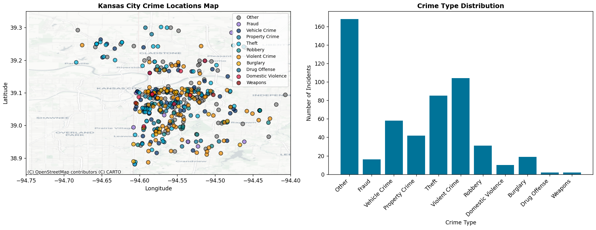

# Kansas City Crime Data Streaming Pipeline

## Project Overview

This project streams Kansas City Police Department crime data from 2025 through a Kafka pipeline and visualizes incidents in real-time. The system simulates live crime reporting by reading historical CSV data and processing it as if incidents are being reported as they occur.

## Key Insight

The visualization reveals crime distribution patterns across Kansas City, showing both geographic clustering and crime type prevalence. By categorizing over 150 specific offense types into 11 broader categories (Violent Crime, Theft, Vehicle Crime, Burglary, Robbery, Property Crime, Drug Offense, Weapons, Fraud, Domestic Violence, and Other), we can identify crime hotspots and understand which types of incidents are most common in the city.

## Data Processing

As each crime incident message arrives via Kafka, the consumer:

1. **Extracts location data** - Parses latitude/longitude coordinates from the POINT format
2. **Categorizes the offense** - Groups specific crimes into broader analytical categories
3. **Updates the map** - Plots the incident location on an interactive Kansas City street map with color coding by crime type
4. **Updates statistics** - Increments category counts displayed in the bar chart

This real-time processing is valuable because it demonstrates how streaming analytics can help law enforcement identify emerging crime patterns, allocate resources to high-incident areas, and understand the composition of criminal activity across different neighborhoods.

## Configuration

Key settings in `.env`:
- `CRIME_INTERVAL_SECONDS=2` - Controls streaming speed (seconds between incidents)
- `CRIME_MAX_POINTS_DISPLAY=500` - Maximum points shown on map
- `CRIME_TOPIC=kc_crime_2025` - Kafka topic name

## Crime Categories

The system groups 150+ specific offenses into 11 categories:
- **Violent Crime**: Assault, Murder, Rape, Kidnapping
- **Theft**: Stealing, Shoplifting, Larceny
- **Vehicle Crime**: Auto theft, Recovered stolen vehicles
- **Burglary**: Residential and non-residential break-ins
- **Robbery**: Armed and strong-arm robbery
- **Property Crime**: Vandalism, Arson, Property damage
- **Drug Offense**: Controlled substance violations
- **Weapons**: Firearm possession and violations
- **Fraud**: Identity theft, Embezzlement, Forgery
- **Domestic Violence**: DV-related incidents
- **Other**: All other offense types

## Running the Pipeline

### Prerequisites
- Kafka must be running (see original repo setup instructions)
- Python virtual environment activated

### Start the Producer
```bash
# Windows
py -m producers.crime_producer_webb

# Mac/Linux
python3 -m producers.crime_producer_webb
```

### Start the Consumer
```bash
# Windows
py -m consumers.crime_consumer_webb

# Mac/Linux
python3 -m consumers.crime_consumer_webb
```

## Visualization

The consumer generates a dual-panel visualization that updates in real-time:



**Left Panel**: Interactive map showing crime incident locations plotted on actual Kansas City streets. Each point is color-coded by crime category, allowing quick identification of crime type distribution across different areas.

**Right Panel**: Bar chart displaying the count of incidents by category, providing insight into which types of crimes are most prevalent in the dataset.


## Data Source

KCPD Crime Data 2025 from Kansas City Open Data Portal (data.kcmo.org)
- Dataset contains January 1, 2025 through September 29, 2025
- Original dataset includes 24 fields per incident
- Location data provided in POINT format (longitude, latitude)